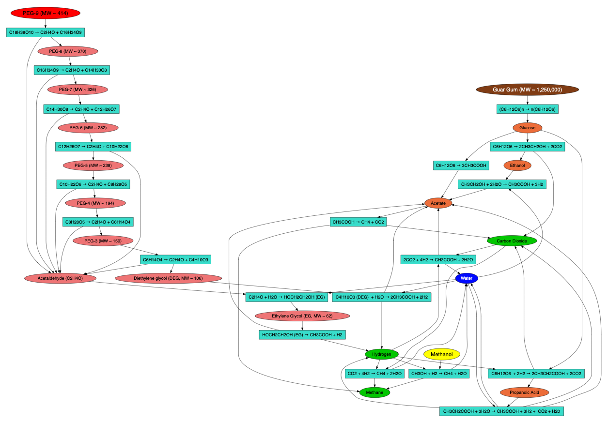

# Anaerobic Batch Reactor

This app is associated with my senior design project in chemical engineering at Drexel University.<sup>[1](#myfootnote1)</sup> 
The model was developed to simulate the degradation of heavy organic compounds through anaerobic digestion. Five unique processes take place in the simulated batch reactor, including the enzymatic hydrolysis of guar gum, acidogenesis of polysaccharide chains, acetogensis, methanogenesis, and anaerobic degredation using bacteroides. See the `Background of Process` tab within the app for a more detailed process description.

[](https://www.youtube.com/watch?v=Z9XZ7gUKEIQ&t=1s)

## Getting Started

The purpose of this app is to optimize the model parameters in order to increase the profitability of the bioreactor. The user will be able to adjust initial bacteria concentrations, reactor temperature (both static and dynamic), etc., and see a visual representation of the outcome. Note that not all adjustable parameters will have an effect on every plot.

As soon as the user loads the app, the model is compiled and run using the current parameter settings. As the user adjusts these parameters, the plots and tables will update according to the new settings.

The tabs on the left then allow the user to navigate the simulated reactor output and read more about the process. You can also specify the time in which to truncate the data and evaluate the output, though the minimum value is currently 100 h. The reactor that follows the anaerobic digestor is capable of removing small quantities left over. Ideally you would set a minimum acceptable concentration, and optimize parameters to decrease the time required to reduce the contaminants to that concentration, though this not been implemented due to the lack of observational data.

### Previewing the Application

* The following link can be used to see how the app works without downloading anything.
  * [barrettkyle.shinyapps.io/BioReactorApp/](https://barrettkyle.shinyapps.io/BioReactorApp/)
* **However**, due to the lack of support for some of the utilized R packages, the model will fail to compile.
  * i.e. No simulated plots or tables will render
  * Thus it is ***only*** useful for understanding the **functionality** of the app


### Prerequisites and Running the App

Prior to running the command make sure you have R installed, along with the following necessary packages:
```
pkg <- c("shiny", "shinyAce", "shinydashboard", "dplyr", "knitr", "plyr", "tidyverse", "cowplot",
         "wrapr", "extrafont", "polynom", "ggplot2", "shinyWidgets", "gridExtra", "rmarkdown", "kableExtra",
         "markdown", "sn", "rlang", "lattice", "reshape", "reshape2", "magrittr", "stats","reactlog")
new.pkg <- pkg[!(pkg %in% installed.packages())]
if (length(new.pkg)) {
  install.packages(new.pkg,dependencies=T)
}
library(devtools)
devtools::install_github("metrumresearchgroup/mrgsolve", ref="dev")
```
Installing the above packages prior to running will speed up the initial loading by a lot. Make sure each of the packages can be loaded via `library()`. **Note**: You will need *Rtools* (windows) or *Xcode* (mac) installed in order to use ***[mrgsolve](https://github.com/metrumresearchgroup/mrgsolve)***. See footnote for further details on mac install.<sup>[2](#myfootnote2)
</sup> To run the app locally, run the following commands:
```
library(shiny)
runGitHub("AnaerobicDigestion","KyleBarrett")
```

## Proposed Reaction Mechanisms involved in process

Contaminants being converted in bioreactor:
- Guar Gum (Brown)
- PEG 400 (Red)
- Methanol (Yellow) & Isopropanol (Orange)
- Petroleum Distillates (Not shown)




## Side Tabs in App

  * Use the `Model Parameters` tab to adjust the model inputs. Clicking a category will open a separate menu with adjustable parameters. Click the category again to make the menu disappear. Kinetic variability can be adjusted using the `Variability` tab.
  


  * Use the `Plots` tab to view a specific set of plots. Selections include *Main Components*,  *Intermediate Products*,  *Bacteria Growth*, and *Reactor Properties*.

  * Use the `Tables` tab to view the input and output concentrations. Selections include *Main Components*  and *Reactor Properties*.
 
  * Use the `Codes` tab to display and download the model file, <tt>AnaerobicDigestionShiny.cpp</tt>, or the <tt>app.R</tt> used for this application. Note that other scripts are needed to run the model.

  * Use the `Mathematical Model` tab  to display the differential equations present in the model.
  
  * Use the `Background of Process` tab to download a PDF summarizing the model process.

### Sensitivity Analysis

The `simulation` option will allow for a sensitivity analysis of a chosen parameter. Below is an example of how to perform a sensitivity analysis on a given parameter:


  

## Acknowledgments

* Author: **Kyle Barrett**
* Group Members: Kyle Barrett, Luke Growney, Prem Patel, Farhaan Rizvi
* Modeled using [mrgsolve](https://github.com/metrumresearchgroup/mrgsolve) - Solving of PDE's 
* For more information about this project, check out the final [paper](https://www.researchgate.net/publication/334129447_Final_Paper) or higher level [summary](https://www.researchgate.net/publication/334129517_Final_Presentation).

<a name="myfootnote1">1</a>:
    Year: 2019, Team Name: "Frack Off", Senior Design Project at Drexel University
    
<a name="myfootnote2">2</a>:
    Note for mac install: The following lines may have to be entered into the Terminal if you recieve an error mentioning a `math.h` file not being found:
    
    sudo installer -pkg \
    /Library/Developer/CommandLineTools/Packages/macOS_SDK_headers_for_macOS_10.14.pkg \
    -target /
